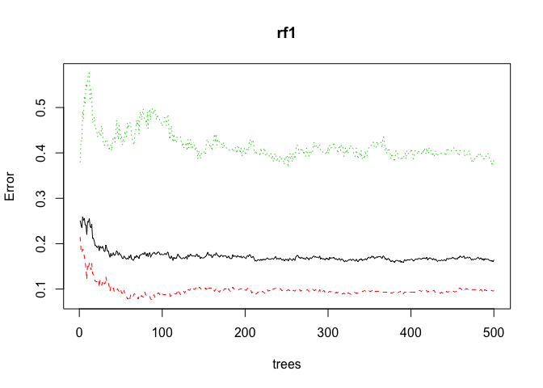
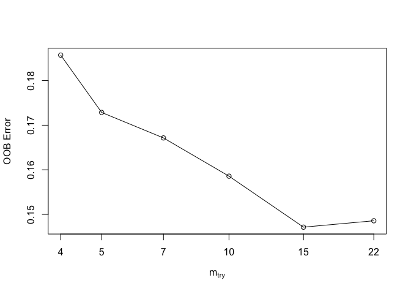
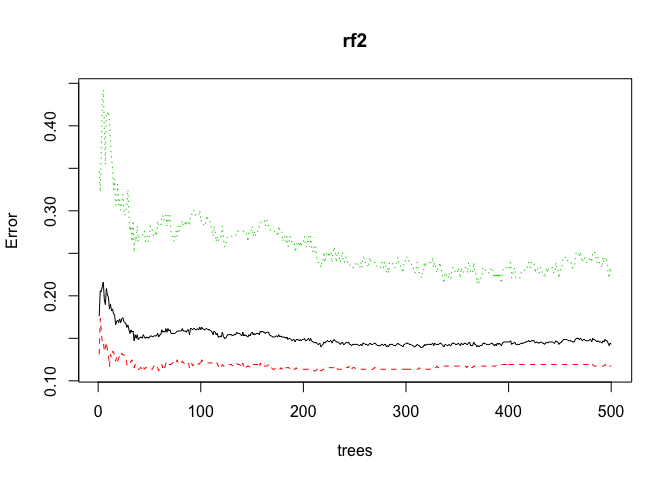

R/Business - Insurance Fraud Detection
================

R Business - Insurance Fraud Detection I
----------------------------------------

Our goal at R Business is to encourage the use of R Studio in a varity of industries where it is current use has been underdevloped. One of these industries is insurance where Excel, VBA and SAS still seem to be the dominant forces. This tutorial is meant to show a simple example of what R Studio is capable of in an insurance related Use Case. Namely the detection of potential fraudulent activity. This is an extremely simplified data set and workflow, but the basic procedure remains the same even in more complex real world examples.

Assumptions
-----------

This tutorial assumes some basic competency with [R Studio](https://rstudio.com/) and the [Random Forest](https://en.wikipedia.org/wiki/Random_forest) method. If you aren't familiar with these I would recommend you first read up on them in the links provided.

Load Libraries
--------------

The first step is to load all the libraries you will need during this example. We will need quite a lot of them in order to properly run this analysis. One of the main benefits of R Studio is the richness of high quality libraries for complex statistical methods.

``` r
# Load Libraries
library(dplyr)
library(readr)
library(randomForest)
library(rfUtilities)
library(rsample)
library(ggplot2)
library(caret)
library(e1071)
library(skimr)
```

Load Data
---------

The next step is to load the data and perform an initial check. This particular dataset if from [Kaggle](https://www.kaggle.com/buntyshah/auto-insurance-claims-data). I would recommend downloading it and putting it into your [local directory](https://support.rstudio.com/hc/en-us/articles/200711843-Working-Directories-and-Workspaces).

``` r
#Loading and Discovery

# Load Data
data <- read_csv("insurance_claims.csv")

# First Look at Data
head(data)
```

    ## # A tibble: 6 x 39
    ##   months_as_custo…   age policy_number policy_bind_date policy_state
    ##              <dbl> <dbl>         <dbl> <chr>            <chr>       
    ## 1              328    48        521585 10/17/14         OH          
    ## 2              228    42        342868 6/27/06          IN          
    ## 3              134    29        687698 9/6/00           OH          
    ## 4              256    41        227811 5/25/90          IL          
    ## 5              228    44        367455 6/6/14           IL          
    ## 6              256    39        104594 10/12/06         OH          
    ## # … with 34 more variables: policy_csl <chr>, policy_deductable <dbl>,
    ## #   policy_annual_premium <dbl>, umbrella_limit <dbl>, insured_zip <dbl>,
    ## #   insured_sex <chr>, insured_education_level <chr>,
    ## #   insured_occupation <chr>, insured_hobbies <chr>,
    ## #   insured_relationship <chr>, capital_gains <dbl>, capital_loss <dbl>,
    ## #   incident_date <chr>, incident_type <chr>, collision_type <chr>,
    ## #   incident_severity <chr>, authorities_contacted <chr>,
    ## #   incident_state <chr>, incident_city <chr>, incident_location <chr>,
    ## #   incident_hour_of_the_day <dbl>, number_of_vehicles_involved <dbl>,
    ## #   property_damage <chr>, bodily_injuries <dbl>, witnesses <dbl>,
    ## #   police_report_available <chr>, total_claim_amount <dbl>,
    ## #   injury_claim <dbl>, property_claim <dbl>, vehicle_claim <dbl>,
    ## #   auto_make <chr>, auto_model <chr>, auto_year <dbl>,
    ## #   fraud_reported <chr>

Inspect Data
------------

Since everything seems fine we should dive a little deeper into it. Let's check data types and NAs. The "skim" function also provides a lot of insight.

``` r
# Check Types
sapply(data, class)
```

    ##          months_as_customer                         age 
    ##                   "numeric"                   "numeric" 
    ##               policy_number            policy_bind_date 
    ##                   "numeric"                 "character" 
    ##                policy_state                  policy_csl 
    ##                 "character"                 "character" 
    ##           policy_deductable       policy_annual_premium 
    ##                   "numeric"                   "numeric" 
    ##              umbrella_limit                 insured_zip 
    ##                   "numeric"                   "numeric" 
    ##                 insured_sex     insured_education_level 
    ##                 "character"                 "character" 
    ##          insured_occupation             insured_hobbies 
    ##                 "character"                 "character" 
    ##        insured_relationship               capital_gains 
    ##                 "character"                   "numeric" 
    ##                capital_loss               incident_date 
    ##                   "numeric"                 "character" 
    ##               incident_type              collision_type 
    ##                 "character"                 "character" 
    ##           incident_severity       authorities_contacted 
    ##                 "character"                 "character" 
    ##              incident_state               incident_city 
    ##                 "character"                 "character" 
    ##           incident_location    incident_hour_of_the_day 
    ##                 "character"                   "numeric" 
    ## number_of_vehicles_involved             property_damage 
    ##                   "numeric"                 "character" 
    ##             bodily_injuries                   witnesses 
    ##                   "numeric"                   "numeric" 
    ##     police_report_available          total_claim_amount 
    ##                 "character"                   "numeric" 
    ##                injury_claim              property_claim 
    ##                   "numeric"                   "numeric" 
    ##               vehicle_claim                   auto_make 
    ##                   "numeric"                 "character" 
    ##                  auto_model                   auto_year 
    ##                 "character"                   "numeric" 
    ##              fraud_reported 
    ##                 "character"

``` r
# Check for NAs 
data[!complete.cases(data),] #non found
```

    ## # A tibble: 0 x 39
    ## # … with 39 variables: months_as_customer <dbl>, age <dbl>,
    ## #   policy_number <dbl>, policy_bind_date <chr>, policy_state <chr>,
    ## #   policy_csl <chr>, policy_deductable <dbl>,
    ## #   policy_annual_premium <dbl>, umbrella_limit <dbl>, insured_zip <dbl>,
    ## #   insured_sex <chr>, insured_education_level <chr>,
    ## #   insured_occupation <chr>, insured_hobbies <chr>,
    ## #   insured_relationship <chr>, capital_gains <dbl>, capital_loss <dbl>,
    ## #   incident_date <chr>, incident_type <chr>, collision_type <chr>,
    ## #   incident_severity <chr>, authorities_contacted <chr>,
    ## #   incident_state <chr>, incident_city <chr>, incident_location <chr>,
    ## #   incident_hour_of_the_day <dbl>, number_of_vehicles_involved <dbl>,
    ## #   property_damage <chr>, bodily_injuries <dbl>, witnesses <dbl>,
    ## #   police_report_available <chr>, total_claim_amount <dbl>,
    ## #   injury_claim <dbl>, property_claim <dbl>, vehicle_claim <dbl>,
    ## #   auto_make <chr>, auto_model <chr>, auto_year <dbl>,
    ## #   fraud_reported <chr>

``` r
# Summarize Data
skim(data)
```

|                                                  |      |
|:-------------------------------------------------|:-----|
| Name                                             | data |
| Number of rows                                   | 1000 |
| Number of columns                                | 39   |
| \_\_\_\_\_\_\_\_\_\_\_\_\_\_\_\_\_\_\_\_\_\_\_   |      |
| Column type frequency:                           |      |
| character                                        | 21   |
| numeric                                          | 18   |
| \_\_\_\_\_\_\_\_\_\_\_\_\_\_\_\_\_\_\_\_\_\_\_\_ |      |
| Group variables                                  | None |

**Variable type: character**

| skim\_variable            |  n\_missing|  complete\_rate|  min|  max|  empty|  n\_unique|  whitespace|
|:--------------------------|-----------:|---------------:|----:|----:|------:|----------:|-----------:|
| policy\_bind\_date        |           0|               1|    6|    8|      0|        951|           0|
| policy\_state             |           0|               1|    2|    2|      0|          3|           0|
| policy\_csl               |           0|               1|    7|    8|      0|          3|           0|
| insured\_sex              |           0|               1|    4|    6|      0|          2|           0|
| insured\_education\_level |           0|               1|    2|   11|      0|          7|           0|
| insured\_occupation       |           0|               1|    5|   17|      0|         14|           0|
| insured\_hobbies          |           0|               1|    4|   14|      0|         20|           0|
| insured\_relationship     |           0|               1|    4|   14|      0|          6|           0|
| incident\_date            |           0|               1|    6|    7|      0|         60|           0|
| incident\_type            |           0|               1|   10|   24|      0|          4|           0|
| collision\_type           |           0|               1|    1|   15|      0|          4|           0|
| incident\_severity        |           0|               1|   10|   14|      0|          4|           0|
| authorities\_contacted    |           0|               1|    4|    9|      0|          5|           0|
| incident\_state           |           0|               1|    2|    2|      0|          7|           0|
| incident\_city            |           0|               1|    8|   11|      0|          7|           0|
| incident\_location        |           0|               1|   11|   23|      0|       1000|           0|
| property\_damage          |           0|               1|    1|    3|      0|          3|           0|
| police\_report\_available |           0|               1|    1|    3|      0|          3|           0|
| auto\_make                |           0|               1|    3|   10|      0|         14|           0|
| auto\_model               |           0|               1|    2|   14|      0|         39|           0|
| fraud\_reported           |           0|               1|    1|    1|      0|          2|           0|

**Variable type: numeric**

| skim\_variable                 |  n\_missing|  complete\_rate|        mean|          sd|           p0|        p25|       p50|        p75|         p100| hist  |
|:-------------------------------|-----------:|---------------:|-----------:|-----------:|------------:|----------:|---------:|----------:|------------:|:------|
| months\_as\_customer           |           0|               1|      203.95|      115.11|         0.00|     115.75|     199.5|     276.25|       479.00| ▅▇▇▃▂ |
| age                            |           0|               1|       38.95|        9.14|        19.00|      32.00|      38.0|      44.00|        64.00| ▃▇▇▃▂ |
| policy\_number                 |           0|               1|   546238.65|   257063.01|    100804.00|  335980.25|  533135.0|  759099.75|    999435.00| ▇▇▇▇▇ |
| policy\_deductable             |           0|               1|     1136.00|      611.86|       500.00|     500.00|    1000.0|    2000.00|      2000.00| ▇▇▁▁▇ |
| policy\_annual\_premium        |           0|               1|     1256.41|      244.17|       433.33|    1089.61|    1257.2|    1415.69|      2047.59| ▁▃▇▃▁ |
| umbrella\_limit                |           0|               1|  1101000.00|  2297406.60|  -1000000.00|       0.00|       0.0|       0.00|  10000000.00| ▇▁▁▁▁ |
| insured\_zip                   |           0|               1|   501214.49|    71701.61|    430104.00|  448404.50|  466445.5|  603251.00|    620962.00| ▇▃▁▁▅ |
| capital\_gains                 |           0|               1|    25126.10|    27872.19|         0.00|       0.00|       0.0|   51025.00|    100500.00| ▇▂▃▂▁ |
| capital\_loss                  |           0|               1|   -26793.70|    28104.10|   -111100.00|  -51500.00|  -23250.0|       0.00|         0.00| ▁▁▅▂▇ |
| incident\_hour\_of\_the\_day   |           0|               1|       11.64|        6.95|         0.00|       6.00|      12.0|      17.00|        23.00| ▇▇▆▇▇ |
| number\_of\_vehicles\_involved |           0|               1|        1.84|        1.02|         1.00|       1.00|       1.0|       3.00|         4.00| ▇▁▁▅▁ |
| bodily\_injuries               |           0|               1|        0.99|        0.82|         0.00|       0.00|       1.0|       2.00|         2.00| ▇▁▇▁▇ |
| witnesses                      |           0|               1|        1.49|        1.11|         0.00|       1.00|       1.0|       2.00|         3.00| ▇▇▁▇▇ |
| total\_claim\_amount           |           0|               1|    52761.94|    26401.53|       100.00|   41812.50|   58055.0|   70592.50|    114920.00| ▃▂▇▅▁ |
| injury\_claim                  |           0|               1|     7433.42|     4880.95|         0.00|    4295.00|    6775.0|   11305.00|     21450.00| ▅▇▅▃▁ |
| property\_claim                |           0|               1|     7399.57|     4824.73|         0.00|    4445.00|    6750.0|   10885.00|     23670.00| ▅▇▅▂▁ |
| vehicle\_claim                 |           0|               1|    37928.95|    18886.25|        70.00|   30292.50|   42100.0|   50822.50|     79560.00| ▃▂▇▆▁ |
| auto\_year                     |           0|               1|     2005.10|        6.02|      1995.00|    2000.00|    2005.0|    2010.00|      2015.00| ▇▆▇▇▆ |

Data Wrangling - Prepare Data for Random Forest
-----------------------------------------------

This part is where it gets (a little) tricky. If we had found any NAs we would have had to remove them at this point. The na.omit() function makes that very easy. Good data cleaning can be about 80% of the work in these projects, but luckliy we already have some very clean data. All we need to do here is convert some of the column types to more sensical formats.

Prepare Data for Random Forest
==============================

Next we turn the character columns into factors, so that they work with the Random Forest function. We also check the amount of unique values per column.

``` r
# turn into factors
data <- data %>% mutate_if(is.character, as.factor)

# Check for amount of uniqe values
sapply(sapply(data, unique), length)
```

    ##          months_as_customer                         age 
    ##                         391                          46 
    ##               policy_number            policy_bind_date 
    ##                        1000                         951 
    ##                policy_state                  policy_csl 
    ##                           3                           3 
    ##           policy_deductable       policy_annual_premium 
    ##                           3                         991 
    ##              umbrella_limit                 insured_zip 
    ##                          11                         995 
    ##                 insured_sex     insured_education_level 
    ##                           2                           7 
    ##          insured_occupation             insured_hobbies 
    ##                          14                          20 
    ##        insured_relationship               capital_gains 
    ##                           6                         338 
    ##                capital_loss               incident_date 
    ##                         354                          60 
    ##               incident_type              collision_type 
    ##                           4                           4 
    ##           incident_severity       authorities_contacted 
    ##                           4                           5 
    ##              incident_state               incident_city 
    ##                           7                           7 
    ##           incident_location    incident_hour_of_the_day 
    ##                        1000                          24 
    ## number_of_vehicles_involved             property_damage 
    ##                           4                           3 
    ##             bodily_injuries                   witnesses 
    ##                           3                           4 
    ##     police_report_available          total_claim_amount 
    ##                           3                         763 
    ##                injury_claim              property_claim 
    ##                         638                         626 
    ##               vehicle_claim                   auto_make 
    ##                         726                          14 
    ##                  auto_model                   auto_year 
    ##                          39                          21 
    ##              fraud_reported 
    ##                           2

Random Forest wont work if there are too many unique values in a factor, which is why we remove those above a certain threshhold. This is more art than science though. The Random Forest will give you a warning if you exceed certain limits.

``` r
# Drop obvious colimns
drops <- c('incident_location','policy_bind_date','incident_date','insured_occupation','insured_zip', 'policy_number')
data <- data[ , !(names(data) %in% drops)]
```

Split Data
----------

As in any good analysis we need test and training data. We use a seed so that others ca replicate the random process later.

``` r
# For reproducability
set.seed(52)

# Split Data
data_split <- initial_split(data, prop = .7)
data_train <- training(data_split)
data_test  <- testing(data_split )
```

Basic Implementation & Analysis
-------------------------------

Now we get to the really fun part. R makes it easy to implement a Random Forest. This will act as our baseline for tuning.

``` r
# Basic Implementation & Analysis

# default RF model
rf1 <- randomForest(
  formula = fraud_reported ~ .,
  data    = data_train)

# Model
rf1
```

    ## 
    ## Call:
    ##  randomForest(formula = fraud_reported ~ ., data = data_train) 
    ##                Type of random forest: classification
    ##                      Number of trees: 500
    ## No. of variables tried at each split: 5
    ## 
    ##         OOB estimate of  error rate: 16.43%
    ## Confusion matrix:
    ##     N   Y class.error
    ## N 485  52  0.09683426
    ## Y  63 100  0.38650307

Check Results
=============

This doesn't look bad for a first try. Let's get a better look by visualizing the performance.

``` r
# Plot tree
plot(rf1)
```



``` r
#Variable Importance
rf1$importance
```

    ##                             MeanDecreaseGini
    ## months_as_customer                 6.1895755
    ## age                                4.8116902
    ## policy_state                       1.7719816
    ## policy_csl                         1.7662902
    ## policy_deductable                  1.6649264
    ## policy_annual_premium              7.0670864
    ## umbrella_limit                     2.9365130
    ## insured_sex                        0.8825515
    ## insured_education_level            7.7944763
    ## insured_hobbies                   43.0611661
    ## insured_relationship               5.6614599
    ## capital_gains                      3.6263267
    ## capital_loss                       4.3200534
    ## incident_type                      1.4105588
    ## collision_type                     3.4635895
    ## incident_severity                 40.1921417
    ## authorities_contacted              3.7900362
    ## incident_state                     6.9423771
    ## incident_city                      7.3275524
    ## incident_hour_of_the_day           5.5585366
    ## number_of_vehicles_involved        1.3001746
    ## property_damage                    1.9000206
    ## bodily_injuries                    2.0601988
    ## witnesses                          2.2398011
    ## police_report_available            1.8649355
    ## total_claim_amount                 7.2697731
    ## injury_claim                       6.7581040
    ## property_claim                     7.8267069
    ## vehicle_claim                      8.1847139
    ## auto_make                         12.1861909
    ## auto_model                        32.7189504
    ## auto_year                          4.9131122

RF Tuning
---------

In order to improve our initial results we can use the tuneRF() function. It will help us find the right values for the number of trees.

``` r
# create training and validation data 
data_split <- initial_split(data_train, .8)

# validation data
data_valid <- assessment(data_split)

# names of features
features <- setdiff(names(data_valid),"fraud_reported")

# tune Random Forest
rf2 <- tuneRF(
  x          = data_train[features],
  y          = data_train$fraud_reported,
  ntreeTry   = 500,
  mtryStart  = 5,
  stepFactor = 1.5,
  improve    = 0.01,
  trace      = TRUE      # to not show real-time progress 
)
```

    ## mtry = 5  OOB error = 17.29% 
    ## Searching left ...
    ## mtry = 4     OOB error = 18.57% 
    ## -0.07438017 0.01 
    ## Searching right ...
    ## mtry = 7     OOB error = 16.71% 
    ## 0.03305785 0.01 
    ## mtry = 10    OOB error = 15.86% 
    ## 0.05128205 0.01 
    ## mtry = 15    OOB error = 14.71% 
    ## 0.07207207 0.01 
    ## mtry = 22    OOB error = 14.86% 
    ## -0.009708738 0.01



Check results
=============

Nice Improvement!

``` r
# Try best version
rf2 <- randomForest(
  x          = data_train[features],
  y          = data_train$fraud_reported,
  data    = data_train,
  ntree = 500,
  mtry = 22
)

#Check results
rf2
```

    ## 
    ## Call:
    ##  randomForest(x = data_train[features], y = data_train$fraud_reported,      ntree = 500, mtry = 22, data = data_train) 
    ##                Type of random forest: classification
    ##                      Number of trees: 500
    ## No. of variables tried at each split: 22
    ## 
    ##         OOB estimate of  error rate: 14.29%
    ## Confusion matrix:
    ##     N   Y class.error
    ## N 474  63   0.1173184
    ## Y  37 126   0.2269939

Vizualize
=========

``` r
# Plot tree
plot(rf2)
```



``` r
#Variable Importance
rf2$importance
```

    ##                             MeanDecreaseGini
    ## months_as_customer                 2.7884879
    ## age                                2.6932085
    ## policy_state                       0.7061059
    ## policy_csl                         0.6692318
    ## policy_deductable                  0.7556180
    ## policy_annual_premium              4.5000726
    ## umbrella_limit                     2.5754507
    ## insured_sex                        0.3479766
    ## insured_education_level            5.5263785
    ## insured_hobbies                   67.1040737
    ## insured_relationship               3.7237807
    ## capital_gains                      1.8782141
    ## capital_loss                       2.7611733
    ## incident_type                      0.3185665
    ## collision_type                     1.3157953
    ## incident_severity                 71.1985259
    ## authorities_contacted              1.5761176
    ## incident_state                     4.4731286
    ## incident_city                      4.5065134
    ## incident_hour_of_the_day           4.6940646
    ## number_of_vehicles_involved        1.1449882
    ## property_damage                    0.5221688
    ## bodily_injuries                    0.8711579
    ## witnesses                          1.2004215
    ## police_report_available            0.8192690
    ## total_claim_amount                 2.8555366
    ## injury_claim                       2.9272785
    ## property_claim                     3.7762521
    ## vehicle_claim                      4.2655718
    ## auto_make                          3.8984872
    ## auto_model                        40.2926387
    ## auto_year                          3.1491285

Predicting
----------

Now we use this RF model to predict the test set. This seems to still be a bit buggy now.

``` r
# randomForest
data_test$pred <- predict(rf2, data_test)
table(observed = data_test$fraud_reported, predicted = data_test$pred)
```

    ##         predicted
    ## observed   N   Y
    ##        N 188  28
    ##        Y  23  61
